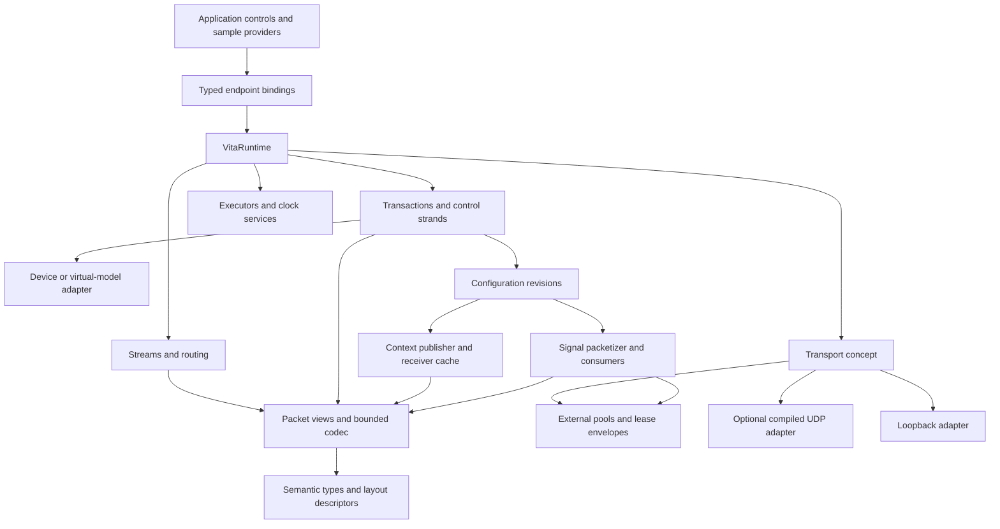
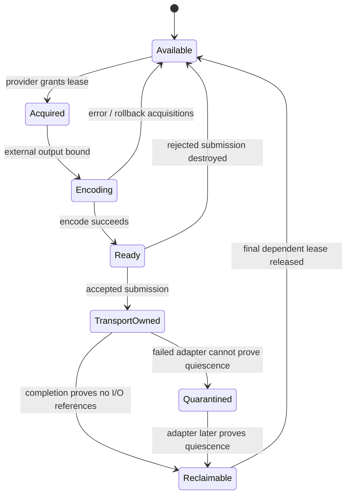
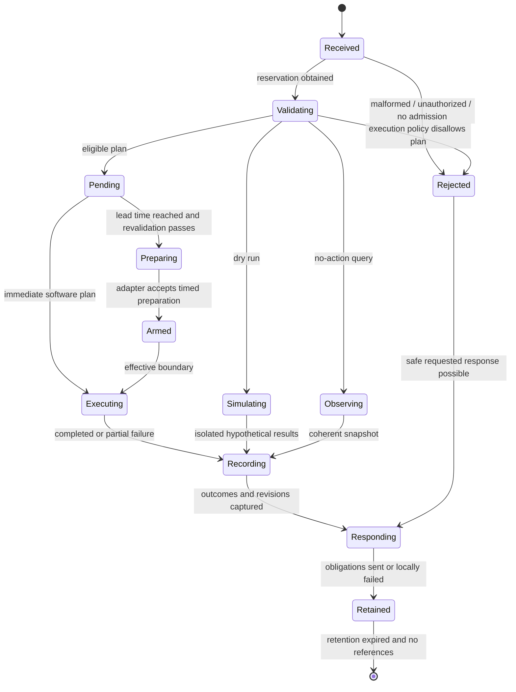
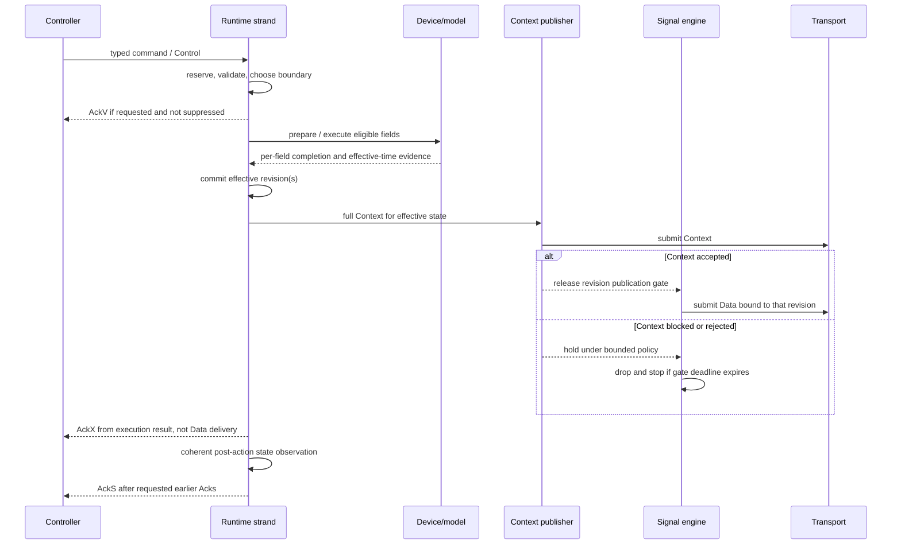
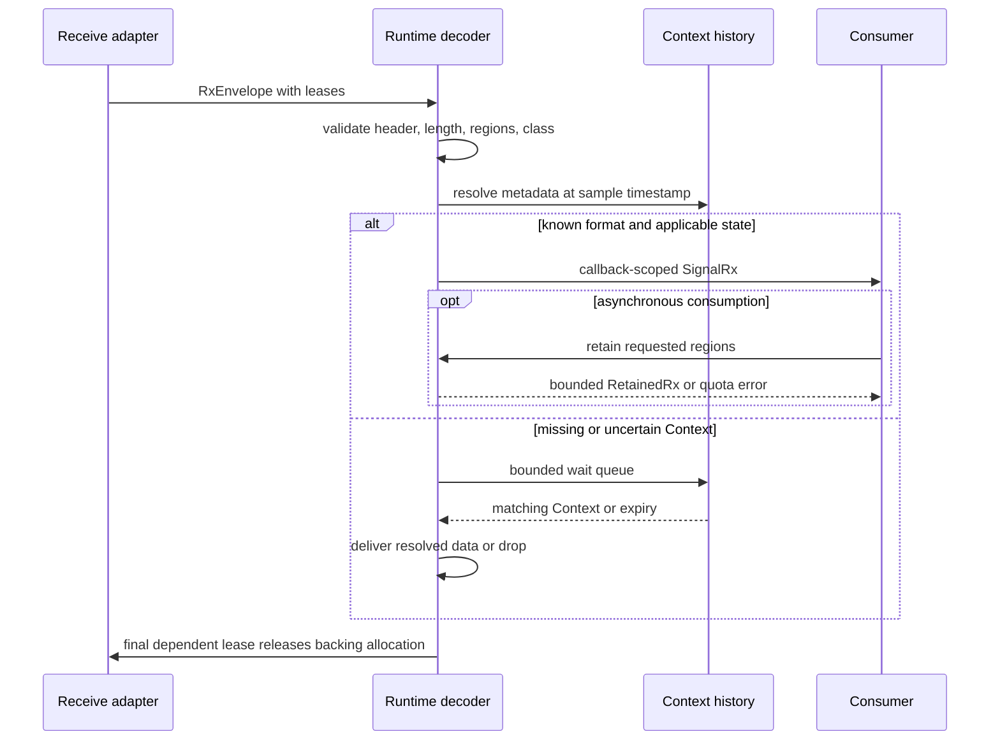

# VITA 49.2 framework architecture

Status: architecture baseline for implementation; not an implementation or conformance certification. Prepared 2026-09-17; review contracts clarified 2026-09-18.

This document executes [the architect prompt](../VITA49.2_High_Performance_Framework_Architect_Prompt.md). It preserves the accepted [IQ Generator Profile v1](iq_generator_profile_proposal.md) and Decisions 1–10, including wall-clock operation, GPS/PPS conditioning, uncommon packet-boundary rate changes, partial execution, and configuration revisions. The companion [protocol design](vita49_protocol_design.md) supplies class documentation, codec coverage, CAM tables, interpretation decisions, and fixtures.

## 1. Executive decision and scope

Build a C++23 header-only semantic/codec/runtime core using compile-time field descriptors, concepts, and small type-erased endpoint/adapter bindings. Use a serialized control strand per Controllee, immutable configuration revisions for the sample path, and move-only external buffer leases. Start with a deterministic loopback adapter and a compiled POSIX UDP adapter. No application implements protocol loops or constructs acknowledgements.

The generic framework covers assigned packet families 0x0–0x7, bounded standard-field wire layouts, selector-only commands, diagnostics, and registered extensions. The first application emits time-domain complex IQ16/IQ32/float32, publishes Context, and implements Sample Rate as its only writable standard control. These are separate scope dimensions: full family coverage does not promise arbitrary device controls, vendor semantics, or optimized conversion for every sample format.

The normative source is ANSI/VITA 49.2-2017 (R2024), including the errata on its cover, supplied at `/Users/rklinkhammer/Downloads/AV49DOT2-2017-R2024.pdf`. References below use printed pages; PDF page = printed page + 16. Sections 4 and 10 govern Information/Class documentation; Sections 5–9 govern packets and fields. Software decisions here are project choices unless explicitly identified as protocol constraints. Apparent contradictions are resolved for this profile in the interpretation register, not asserted as official VITA rulings.

Precedence: explicit accepted user decisions and the current prompt govern software scope; the accepted profile governs generator behavior; this architecture selects delegated defaults. The review is rationale/history. Normative wire constraints take precedence over illustrative examples; conflicts with project requirements are recorded rather than concealed. Deployment may replace stated defaults only through validated configuration or a documented class variant. It may not silently change an existing peer's wire contract.

Accepted P14 scope clarification (2026-09-19): Beam Width and Barometric Pressure expose lossless raw codes with the undisputed wire extents/reserved-bit checks. Engineering-unit conversion remains unsupported because the supplied rules conflict. No corrected physical-value dialect is implied; see [D-P14-1/2](implementation/P14-decisions.md). This limitation does not change the baseline IQ profile. The subsequently accepted general raw-code-only policy also covers Probability and Spectrum weighting: where wire layout is clear but engineering conversion is contradictory or unspecified, preserve raw codes and document the conversion limitation. Do not guess ambiguous layouts, reserved bits, control behavior or hardware contracts; see D-P14-3 in the same decision record.

### 1.1 Selected reference configuration

These values make the design and benchmarks reproducible. They are proposed engineering defaults, not measured capabilities or additional accepted performance requirements.

| Input | Reference choice |
|---|---|
| OS/CPU | Linux x86-64 or AArch64; one NUMA node, 8 available cores, 16 GiB host RAM, 10 GbE NIC for external benchmark |
| Toolchain qualification | GCC 14 + libstdc++ or Clang 19 + libc++, C++23 feature probes; Linux is initial production qualification target |
| Developer platform | macOS with a toolchain passing the same feature probes; loopback/UDP functional qualification, no real-time claim |
| Entities | Up to 16 Controllers, 16 Controllees, 16 generator Information Streams, 8 transport bindings |
| Normal benchmark | Four simultaneous streams, each 1 MS/s complex IQ16, 256 samples/packet, 1,500-byte IP MTU |
| Stress benchmark | One 100 MS/s IQ16 stream, 256 samples/packet; reject admission if resources cannot sustain it |
| Framework memory cap | 64 MiB preallocated arenas/pools in this configuration, excluding OS socket memory and application-owned device buffers |
| Control rate | 100 accepted ordinary commands/s/runtime, burst 64; up to 4 writable fields/command in synthetic backend tests |
| Control capacity | 256 active transactions/runtime, at most 32 per Controllee; 128 scheduled, at most 16 per Controllee |
| Horizon | 10 s maximum future scheduling; pending work counts against active capacity |
| Transport | One VRT packet/UDP datagram, IPv4/IPv6, no IP fragmentation in reference configuration |
| Timing | Untimed Control mode 0 available independently of Data start; Data still requires the qualified protocol-clock policy. Control modes 1–4 require device timing qualification (§8) |

No licensed OUI, actual peer, GPS receiver, NIC model, precise timing bounds, or measured throughput was supplied. Section 16 records the required deployment inputs. Missing numerical guarantees do not prevent development against deterministic fixtures.

## 2. Components and dependencies



| Module | Responsibility and dependency boundary |
|---|---|
| `vita/fields` | Units, fixed-point values, descriptor identities, validity; standard C++ only |
| `vita/codec` | Bounded sizing, encoding, structural traversal, sample access/conversion; no socket/device dependency |
| `vita/memory` | Borrowed byte views, memory-domain descriptions, move-only leases, bounded submission/envelope types |
| `vita/runtime` | Registration, route lookup, admission, transactions, timers, Context and sample scheduling |
| `vita/profile/iq_generator_v1` | Class policy, generator bindings, deterministic test oscillator |
| `vita/adapters/loopback` | Inline deterministic transport/executor/clock integration |
| `adapters/posix_udp` | Optional compiled sockets/event-loop integration; kernel dependencies stay here |
| Future adapters | DMA/GPU/DPDK/RDMA and framed streams implement the same capability/lifetime contracts |

Use `inline` functions/variables and templates for header-only definitions. No mandatory global constructors, hidden singleton runtime, modules, third-party allocator, networking library, or coroutine runtime. CMake exports an INTERFACE core target and separate optional adapter targets. Public layouts and inline definitions shall not depend on per-translation-unit configuration macros. Express capacity and policy variation through explicit template parameters (distinct types) or runtime configuration values. Optional adapters use separate targets/namespaces and cannot redefine core types. Multiple translation units must pass ODR/link tests, including different legal policy instantiations in the same program. Do not rely on a linker diagnosing inconsistent inline definitions.

### 2.1 API and language decision

Use concepts plus `constexpr` descriptor tuples for the static field schema. Endpoint registration generates function-pointer thunks with an application-instance pointer; dispatch performs route lookup followed by descriptor lookup and one indirect call. Data producers are statically bound where feasible. CRTP remains an optional convenience wrapper, not the required extension mechanism. This balances code size, diagnostics, and heterogeneous runtime registration; a virtual method per VITA field would enlarge interfaces without solving variable fields.

C++23 facilities used: `std::expected`, `std::span`, `std::bit_cast`, `std::endian`, `std::byteswap`, concepts, and constexpr tables. Require feature probes for the needed library as well as language facilities. Default core builds with RTTI disabled and supports exceptions disabled. Exception-enabled application thunks catch exceptions and translate them to callback failures; an exception-disabled binding requires `noexcept`. No exception crosses an executor or transport boundary. Optional coroutine awaitables wrap the transaction observer API; futures that block are not the primary API.

C++26 reflection was evaluated as an optional means of generating descriptors from annotated structs. The [GCC status table](https://gcc.gnu.org/projects/cxx-status.html) lists P2996R13 reflection under C++26, GCC 16 with `-freflection` and `__cpp_impl_reflection >= 202506L`; [Clang status](https://clang.llvm.org/cxx_status.html) and [libc++ status](https://libcxx.llvm.org/Status/Cxx23.html) must be checked separately for language/library qualification. Decision: do not use reflection in the baseline. A later experimental reflection target requires a compiler probe and must generate exactly the same descriptors as C++23 tuples. Put its helpers in a separate opt-in header/namespace; do not use `VITA_ENABLE_REFLECTION` or another macro to change shared public definitions. Reflection cannot infer CIF locations, units, field extents, or packet-specific semantics. No wire format or public baseline type depends on it. Compiler qualification is planned, not claimed from those status pages.

## 3. Semantic packets, layouts, and codecs

`SignalMetadata`, `ContextPacket`, `ControlPacket`, `QueryPacket`, `CancelPacket`, `DiagnosticAck`, and `StateAck` are composed semantic types. They contain values and selectors, not encoded packet buffers, leases, DMA handles, or transport state. A bounded semantic-value arena may be supplied separately for variable values; its values are not serialized packet storage. The mutable builder is single-owner; `freeze()` creates an immutable semantic snapshot for encoding. Concurrent modification of an unfrozen object is invalid API usage. Encoding a snapshot does not change it or prior transmissions.

Received `PacketView` objects are immutable borrows into an `RxEnvelope`. Structural decoding never invokes callbacks. Views are not semantic packet owners. A typed sample span is offered only when endian representation, alignment, and C++ object lifetime permit it; byte-backed receive memory normally uses endian-aware accessors or explicit conversion.

### 3.1 Context-aware field traversal

A `LayoutContext` contains packet family, subtype, action, Packet Class, enabled CIF words, and selected attributes. Descriptors provide field identity, native semantic type, fixed/variable extent resolver, attribute rules, range validator, wire codec, and profile capability. Normal values, selector-only query/cancellation, and 32-bit diagnostic bodies use different traversal policies over shared identities (Sections 8.3, 8.4.1.2, 8.4.2, 9.1, 9.12).

Decode order: validate header/size, determine family and prologue, validate class and CAM, read the appropriate indicator sets, then traverse fields in CIF-number order and descending bit order. For each field, checked arithmetic computes extent before consuming bytes. Arrays validate total size, record/header counts, optional subfield masks, and contained layout. An understood but unsupported control can be skipped after structural validation; an unknown extent returns `unsupported_layout` and stops traversal. No heuristic resynchronization inside a CIF body.

Use the same `walk_layout` to measure, encode, validate, and build an optional bounded offset index. Every edit increments a generation number; cached offsets/sizes carry that generation and are invalidated by layout changes. CIF7 edits are transactional across all selected fields: supply all newly required values or fail without mutation. Selector-only packets carry no normal values; diagnostic selectors never size bodies using the controlled field's type.

```cpp
// API sketches describe contracts; they are not an implemented library.
auto packet = vita::context(profile);
packet.set<SampleRate>(Hertz{1'000'000});
packet.set<ReferencePoint>(stream_id);
packet.replace<SampleRate>(Hertz{2'000'000});
packet.remove<ReferencePoint>();
auto query = vita::query(profile).select<SampleRate>(); // no value body
// Attribute selection applies to every selected field; reject missing values.
auto changed = packet.with_attributes(
    attributes<Current, Minimum, Maximum>, complete_attribute_values);
auto snapshot = changed->freeze();
auto size = vita::measure(snapshot);
auto result = vita::encode(snapshot, external_output);

for (auto cursor = vita::fields(validated_view, scratch_offsets);
     !cursor.done();) {
    auto field = cursor.next(); // checks extent and bounds before advancing
    if (!field) return field.error();
    consume_structurally_valid_view(*field); // no device execution here
}
```

`CodecResult` contains error code, offset, consumed/written bytes, and required capacity on short output. Measure first; reference encoders do not partially publish output after failure. Partial scratch writes are permitted but explicitly invalid until success. Network decode is always checked. A separately named `assume_validated(view, validation_token)` is available only for an immutable envelope already validated against the same profile/generation; it is not a public raw-byte fast parser.

## 4. Storage and transport ownership

There are three logical Signal Data regions: prologue, payload, optional trailer. The baseline TX chain has at most three physical segments. Generic RX can expose a payload chain with at most 16 physical fragments; these do not become extra VRT regions. An adapter unable to deliver a CPU-readable contiguous prologue must explicitly gather its small header or return a capability error. Command/Context receive requires contiguous external storage; an adapter may coalesce into a reserved pool before decode. Copies are declared by the adapter.

A `BufferLease` is move-only and references an external provider control block, block identity, capacity, alignment, domain, used length, and release operation. Pool memory does not live in packet objects. `BorrowedBytes` is callback-scoped. `retain()` consumes a retention quota and returns a move-only `RetainedRx` backed by a provider reference count; independent retained handles can share allocations. This reconciles move-only public ownership with shared backing storage. A raw span saved outside a callback is a contract violation; debug generations/poisoning help detect it.

```cpp
struct TxSubmission {
    FixedVector<BufferLease, 3> leases;
    FixedVector<SegmentRef, 3> regions;
    CompletionTicket completion; // reserved before submission
};
// accepted: moves all ownership and schedules exactly one completion.
// rejected: returns the entire submission; no callback will occur.
std::expected<TxToken, RejectedSubmission>
try_send(TxSubmission&&) noexcept;

void on_samples(vita::SignalRx const& rx) {
    inspect(rx.payload_bytes());
    if (needs_async_consumer()) {
        auto retained = rx.retain(); // bounded, may fail
        if (retained) enqueue_consumer(std::move(*retained));
    }
}
```

A datagram submission is all-or-nothing. A short datagram write is a transport failure, never a successful partial VRT packet. Byte-stream adapters track a per-connection packet cursor and never interleave another packet between partial writes. Registered transport capabilities include max packet bytes, segment limit, supported memory domains, required alignment, CPU mapping, copy behavior, completion meaning, and quiescence support.



For POSIX UDP, completion after successful kernel copying ends user-buffer access; it is not delivery confirmation. A kernel zero-copy or DMA adapter must wait for the relevant kernel/device completion and visibility fences. TX release fences and device synchronization precede submission; RX acquire/invalidate/mapping completes before CPU decode. GPU-only payloads may travel through a compatible adapter, but CPU codec methods cannot dereference them. Explicit device conversion into external wire storage is required when packing differs.

Retaining only IQ retains every allocation supporting its fragments. Contiguous RX retains the entire allocation even after header/trailer views disappear. Distinct header/data/trailer allocations release independently. Each provider control block survives outstanding leases, including runtime shutdown. Exactly-once return is implemented by ownership transitions and a completion-generation token, not both a destructor and an independently callable return closure.

## 5. Runtime execution and resource admission

Default runtime: one I/O event-loop thread, one control/timer worker, and two data workers. Scale by assigning Controllee strands and streams to additional workers; do not create a thread per stream. A caller-driven executor can run all domains deterministically or on an embedded single thread. Protocol work remains framework-owned. OS priorities/affinity are optional adapter configuration, not portable timing guarantees.

| Work | Execution and concurrency rule |
|---|---|
| Decode / route | I/O worker validates framing and minimal prologue; bounded full control parsing on control worker |
| Setters / validation / state providers | Serialized per Controllee strand; no concurrent mutation of its control state |
| Async device operations | At most one effectful plan active per Controllee by default; future scheduled plans may coexist but are revalidated |
| Completion | Adapter writes reserved completion slot; strand incorporates outcome; no inline application reentrancy |
| IQ producer/consumer | One callback active per stream; different streams run concurrently |
| Status snapshot | On control strand, immutable revision passed to publisher |
| Controller from callback | Nonblocking submission allowed; same-domain blocking wait returns `would_deadlock` |
| Shutdown | Admission closes before callback teardown; outstanding completion tickets keep adapter state alive |

Queue selection: SPSC rings for pinned stream-to-I/O lanes and completion scanning; bounded mutex-backed MPSC inbox for low-rate commands/registration. Do not start with a general lock-free MPMC allocator. Type-erased executor submissions use preallocated nodes. Dedicated threads offer isolation but waste small deployments; pools offer scale but need explicit lanes/quotas. Caller-provided executors must publish progress and nonblocking submission contracts.

Before admitting an effectful command, acquire an admission bundle: transaction slot, value/plan storage, scheduled slot if needed, revision credits, completion ticket, worst-case bounded response credits, and duplicate-result retention slot. Maximum three ordinary response packets plus requested cancellation responses are reserved separately. Control capacity includes revision Context publication credits. Reservations for future commands are logical credits, not NIC descriptors held for ten seconds. If the bundle cannot be obtained, no device callbacks run. A small emergency response pool can produce a bounded rejection where a safe response is possible and requested; otherwise drop with a metric. Explicit failure cannot guarantee remote receipt over UDP.

Cancellation has a separate 64-entry inbox and 64 response credits so a full ordinary command queue cannot prevent cancellation of admitted work. Admission rate limits are enforced per peer and per Controllee; emergency replies are rate-limited. Completion tickets have an atomic state and reserved payload storage, so an adapter can publish completion even if normal executor queues are full; the worker scans tickets with an event/wakeup hint. It must not spin waiting for a queue node while holding device ownership.

I/O arbitration services completions first, then up to 32 control/Context sends, then up to 64 Data sends, and repeats. Independent socket receive budgets prevent an IQ flood from consuming an entire tick. Control receives retain reserved RX buffers. No scheduler can guarantee progress if an application callback blocks indefinitely; nonblocking callback duration budgets are part of endpoint registration, and violations are measured and faulted.

### 5.1 Completion-ticket publication contract

The following is required of every adapter, including synthetic failure producers. Each stable slot has one atomic tagged word containing a 56-bit generation and an 8-bit state. A token carries the exact generation. States are `free -> reserved -> writing -> ready -> reading -> free(next generation)`. The tagged word is indivisible; do not independently compare a generation and then claim a state. A slot whose generation would wrap is retired until the ticket arena is destroyed after quiescence.

1. The admission owner acquires a free slot, initializes ownership/operation metadata, and release-publishes `reserved(g)`. The adapter receives the token through a synchronized handoff only after that initialization.
2. A completion producer must win a compare-exchange from `reserved(g)` to `writing(g)` with acquire-release success ordering before touching the result payload. A failed claim does not read or write the payload. Concurrent duplicate callbacks, stale-generation callbacks, cancellation failure producers, and abandoned-token reporting all use this same claim operation.
3. The winning producer writes the complete non-atomic result payload and release-stores `ready(g)`. Construction is bounded and nonthrowing; adapters must translate errors before claiming. The wakeup is only a hint. A worker must acquire the ready state even if it was awakened by another mechanism.
4. The owning worker claims `ready(g) -> reading(g)` with acquire success ordering before reading payload. Only the winner consumes the result. It incorporates/copies the result into already reserved transaction storage; application callbacks never reference the slot payload after consumption.
5. After payload destruction and confirmation that the operation no longer needs this slot, the owner release-stores `free(g+1)`. A next allocator acquires that state before reuse. Slot storage and the atomic tagged word remain alive through a provider/arena lifetime handle held by every outstanding callback token; generation checking alone does not prevent use-after-free of an arena.

Failed compare-exchanges may use relaxed ordering because the failure path accesses no payload. A duplicate or stale result is counted and ignored. A synthetic timeout/cancellation/token-abandonment result does not prove I/O quiescence: device-accessible buffers remain retained or quarantined until separate adapter quiescence evidence is available. If a producer stalls in `writing`, shutdown must not steal its slot or reclaim its memory. Fault and retain it until the producer/adapter is quiescent. Scanning and draining do not allocate queue nodes.

Required implementation tests: delayed payload writes cannot be observed before `ready`; competing producers yield one result; competing consumers cannot double-consume; stale callbacks fail after reuse; no generation wrap; arena lifetime survives late callbacks; a synthetic failure cannot prematurely reclaim DMA storage. These are future deterministic/TSan tests, not properties proven by the architecture arithmetic checker.

### 5.2 Reference capacities and overload rules

| Resource | Default bound / action |
|---|---|
| Ordinary command inbox | 256; reject before side effects |
| Cancellation inbox | 64, separately reserved |
| Completion tickets | 1,024, admitted operations reserve tickets; duplicates ignored by generation |
| Revisions | 128 per generator, including referenced/pending; reject new transitions when credits unavailable |
| Duplicate cache | 4,096 completed transactions, 30 s minimum retention; no eviction of live entries to admit work |
| Controller observations | 256 transactions; bounded event slots for V/X/S/cancel, coalesce duplicate observations |
| Data TX queue | 256 packets per stream; drop newly due packet under overflow and report gap |
| Context publication gate | Retry until 10 ms or 64 held Data packets; on exhaustion drop held data and stop stream with `context_unavailable` |
| RX Context history | 128 revisions and 2 s retention per stream, whichever limit binds first |
| RX waiting Data | 64 packets or 10 ms per stream, then drop unknown-format data |
| Retained RX | 64 handles per consumer and 1,024 total; retention failure is explicit |
| App retention age | 1 s advisory limit; report violation, deny further retention; never revoke live memory |
| Graceful shutdown | 2 s drain budget, then fault/quarantine unquiesced resources |

All bounded resources are charged to the 64 MiB arena budget; startup computes exact `sizeof`-based storage and fails if over budget. The duplicate cache has an 8 MiB variable-record arena in addition to its 4,096-entry limit; admission reserves canonical command and response storage for the full retention period. Large commands can exhaust bytes before entry count, causing explicit rejection rather than premature eviction. Per-stream queue limits are upper bounds, not a promise of a dedicated block for each queue entry. Pool exhaustion may impose an earlier documented drop. Runtime configuration cannot request more memory than the arena permits.

## 6. Transactions, execution, and cancellation

Transaction key: local binding generation + authorized peer identity + Stream ID + Controller identity + Controllee identity + Message ID. Preserve identity-presence and UUID form in the key. Local session generation is not transmitted and cannot distinguish delayed UDP packets with identical reused wire IDs. Baseline uses fresh SIDs/endpoint identities after restart or a configured quarantine exceeding the assumed network packet lifetime; deployment must supply that lifetime assumption.

Message IDs increment per Controller peer/stream relationship. Never reuse an ID during an active transaction or retention period. On wrap, block allocation or move to a newly coordinated identity/session. No automatic retransmission by default. An opt-in retry sends identical command meaning with the same Message ID within the retention window; deduplication excludes Packet Count but compares canonical payload, CAM, identifiers, and timestamps. Same key/different meaning is a conflict, never a second execution. Active duplicates attach to the same outcome; completed duplicates replay stored semantic results with a new outgoing Packet Count. Do not replay a fresh AckS observation under an old result: replay its original observation and timestamp.

Cancellation retry policy (D-P07-1, accepted 2026-09-18): allow one immutable cancellation request meaning per original transaction identity for its active and retained lifetime. Ordinary Control and cancellation have separate records under the original transaction key, distinguished by header L. The first admitted cancellation may select any valid subset. Identical retries attach to its pending result or replay its original cancellation outcomes and state observation, with new outgoing Packet Count only. A different cancellation meaning is rejected locally by the Controller; the Controllee performs no new cancellation effects and reports a bounded identity/message-conflict diagnostic when safely permitted. Retain cancellation correlation and results together with the original transaction, extending retention to at least 30 seconds after the latest terminal outcome and until outstanding references are released. This deliberately prohibits later different-subset cancellation attempts under the same original Message ID; serialization alone cannot distinguish delayed acknowledgements.



Cancellation is an orthogonal per-field transition, not a transaction-wide replacement of the above machine. Fields move through `validated`, `pending`, `preparing`, `armed`, `executing`, `executed`, `failed`, `cancelled`, or `unknown_effect`. Only the strand authorizes execution or cancellation transitions. The adapter reports whether prepare is reversible, its cutoff, and whether disarm can succeed. Baseline software generator cutoff is the effective revision commit; pending commits can be removed. Hardware cancellation after cutoff reports not cancelled. Late completions are matched to operation generation and cannot resurrect a cancelled software plan; contradictory adapter reports fault the adapter and mark uncertainty.

A whole-command validation plan records requested/adjusted values, dependency DAG, expected-state version, eligible fields, and timing. Revalidate state-dependent constraints just before preparation/commit. Dependency failure suppresses dependent effects even with partial execution allowed. With P=0, known inability to complete the admissible set blocks all effects. P=0 does not create hardware rollback: an unforeseen mid-write failure is reported accurately and remaining effects stop. Adapters declaring atomic batch commit may supply it, but the portable backend contract does not promise atomicity. P/W/Er behavior and error modification rules are in the protocol tables.

Dry run uses a bounded isolated state snapshot. It can predict validation/model outcomes and AckS hypothetical state, but does not create live revision changes, device writes, or live scheduled work. A structured simulation result is tagged throughout the Controller API so successful simulated AckX is never presented as actual execution.

Command callbacks return semantic results, not packets: field validity, adjusted value, write completion, known/unknown resultant state, timing evidence, and diagnostics. A device failure after some registers were written is an incomplete semantic field, even if other fields succeeded. Do not turn CAM `Er=1` into permission to execute an undefined or unsafe operation.

## 7. Configuration revisions and publication

A revision contains `revision_id`, immutable effective values with validity, effective protocol time/sample ordinal, source transaction/field outcomes, and publication status. Requested and pending changes are stored separately. IDs are internal monotonically increasing 64-bit values; drain/restart before wrap. A pending plan reserves its worst-case number of distinct transitions (one per effect group), not just one revision regardless of field count.

The software generator stages a revision before the chosen boundary and commits only when that boundary is due on the monotonic/protocol-clock mapping. It cannot rewrite in-flight buffers. Normal generation is at most one packet interval ahead; metadata and payload are frozen together. Once a packet has been encoded, its revision is immutable. If a hardware transition divides a returned buffer, split on a complete sample boundary when the adapter knows the exact position; otherwise drop ambiguous samples or deliver only an explicitly opaque/unknown view under opt-in consumer policy. Never describe an entire mixed buffer using the newest state.



Relative Context/Ack transmission order is not promised beyond Context-before-affected-Data and CAM acknowledgement ordering. Ack processing must continue even when Context publication fails. A full snapshot includes all known applicable profile fields. Omitting an unknown persistent value does not invalidate a receiver's old value: for unknown Sample Rate or payload format, stop Data, publish Valid Data=false where possible, and require the explicit `recover_stream` operation below and a known full snapshot before restart. Do not invent an unknown numeric sentinel. Local query results expose missing/unknown selected fields; AckS indicates a partial response according to the selected interpretation.

For multiple effective times, publish separate timed revisions in order. They cannot be coalesced if intervening samples or events depend on them. AckX is generated once terminal results for the requested fields are known; use the final actual effect time for multi-effect aggregation, retain individual timing diagnostics, and record this project interpretation in the protocol register. AckS observes the coherent current state at its own timestamp; it may include later intervening changes and is not an archival copy of requested values.

### 7.1 Recovery from unknown required metadata

The application owning the stream initiates the asynchronous runtime API `recover_stream(stream, RecoveryConfig, completion)`. `RecoveryConfig` supplies a newly allocated SID, confirmed source/device configuration, the existing or replacement qualified clock binding, and evidence that the application has provisioned the peer's new static association. This is a local lifecycle API, not a new wire Control field or an automatic retry of the failed command. Ordinary start/resume cannot bypass it when required rate/format is unknown.

Recovery runs on the Controllee strand: `paused_context/faulted -> recovering -> starting -> running`. It closes admission for the old association, stops generation, cancels/disarms pending effects where possible, and waits for in-progress effects to resolve or the adapter to be reinitialized with established quiescence. If the adapter cannot establish known state and stop old effects, recovery fails and the stream remains stopped. Completed effects are not rolled back by this API.

Once safe, discard unsent old Data, pending revisions/publication gates, RX waiting Data, and the association's Context history; detach them without revoking app-held immutable leases. Increment local routing/association generation. Keep old transaction outcomes, duplicate entries, and callbacks under their old keys until their normal retention/quiescence conditions are satisfied. Old late completions can finish old accounting but cannot mutate the recovered stream. Restore required state from explicit model reinitialization or adapter-confirmed state, never from the last requested values.

The default recovery requires a fresh, deployment-allocated SID for all paired Data/Context/Command streams. Controller/Controllee IDs may remain unchanged because the SID changes the wire transaction/association key. The application provisions the peer's static routing and obtains peer readiness before the runtime enables the new association; no discovery or reset packet is invented. The peer creates a fresh cache for the new SID and rejects old-SID data for that association. The runtime installs a new counter domain, commits a known initial revision, and submits a full Context snapshot before affected Data. Context loss still follows normal receiver waiting/recovery policy. The source clock epoch is not reset merely because the SID changed.

Same-SID recovery is unsupported by the reference binding. A future deployment variant must document an out-of-band peer reset barrier, cache invalidation, and a quarantine justified by the maximum network packet lifetime before wire identity reuse. Merely incrementing a local generation is insufficient. Pool- or publication-only failures with known state may use ordinary stop/start, but only after the runtime verifies that no required metadata is unknown.

## 8. Clocks, pacing, and scheduled execution

“Untimed” means Control mode 0 only. It imposes no requested execution timestamp; it does not permit unclocked or timestamp-free Data in the baseline classes. The runtime can serve mode-0 queries/validation and monotonic timeouts while the Data stream is stopped for clock loss. An effectful mode-0 command must still satisfy its backend and boundary requirements: a running generator uses its next eligible boundary; a stopped generator may update its known pre-start configuration without producing Data. Recovery from unknown required state still requires §7.1. Control modes 1–4 need additional qualified execution-window capabilities even when the Data clock itself is qualified.

Data start requires `locked` with a qualified mapping; continuation in bounded `holdover` uses the policy below. There is no implicit production fallback to an arbitrary free-running epoch. Deterministic tests and the named software benchmark may use an explicitly identified injected clock binding, without claiming GPS qualification.

Three interfaces prevent accidental conflation:

| Clock | Contract |
|---|---|
| `MonotonicClock` | Elapsed time for timeouts, pacing wakes, retention and shutdown; never adjusted by GPS epoch corrections |
| `ProtocolClock` | PPS-conditioned external-time mapping, TSI/TSF representation, uncertainty and synchronization state |
| `SampleTimeline` | Piecewise sample ordinal to protocol-time mapping by effective sample rate/revision |

PPS alone is not assumed to identify the second number. `ClockBinding` requires pulse capture, associated time-of-day, epoch/time-scale conversion, calibration uncertainty, and a mapping generation. Store seconds and fractional picoseconds separately with checked carry; never store an entire modern absolute epoch in a signed 64-bit picosecond count. Use integer quotient/remainder accumulation for `10^12 / sample_rate`; no cumulative floating-point timestamp drift. Rate changes start a new segment from the exact previous endpoint, preserving phase. Converting GPS-conditioned time into UTC or Other is an explicit binding choice, not a hardcoded GPS-seconds output.

Default clock states are `unbound`, `acquiring`, `locked`, `holdover`, `faulted`. Production start requires a configured epoch and uncertainty contract. On PPS loss, enter holdover, conservatively clear calibrated-time indication, and reject new precision-dependent commands unless the declared holdover error bound still fits their window. After 2 s without qualifying PPS, stop Data and timed execution by default. A deployment may choose a documented longer holdover. A clock step invalidates scheduled mappings: suspend unarmed work, revalidate against the new mapping, and disarm hardware where possible. Uncancelable armed work is tracked to its actual outcome. Never retime monotonic transaction deadlines. Test clocks can emulate every state without GPS hardware.

Timing windows are explicit half-widths: device early/late `D_e/D_l`, application early/late `A_e/A_l`. Mode 0 ignores the supplied time; mode 1 allows the device window; mode 2 adds the application late window; mode 3 adds the application early window; mode 4 uses the application window. See Table 8.3.1.7-1 and protocol appendix. Choose the eligible packet boundary closest to requested time, with earlier boundary winning ties, provided preparation lead time and uncertainty fit. If none fits, reject; do not shorten packets solely for rate-change timing. Immediate controls use the next uncommitted packet boundary. Equal-boundary commands are ordered by admission sequence, with revalidation between them; conflicting commands cannot both claim the same pre-state.

A deterministic test binding uses D_e=D_l=1 microsecond, A_e=A_l=1 millisecond, 1 millisecond admission lead, and 10 s horizon. These are test parameters, not real host guarantees. A production binding must supply qualified values before modes 1–4 are enabled. Software timers without a validated bound cannot claim precision-mode success merely because they woke near a deadline. A late commit outside the window is rejected before effects where possible; an already occurred effect is reported as a timing failure with actual evidence.

Packet pacing uses wall-clock progress, with bounded catch-up. On a stall, discard wholly obsolete due packet intervals and advance sample ordinal and oscillator phase; do not emit an unbounded burst to catch up. Account for every skipped interval in local metrics and publish the corresponding sample-loss event when resumed data can carry its applicable association. Stop/resume similarly advances the absolute timeline; no epoch reset. A local explicitly requested new generator session may reset oscillator phase but requires peer-coordinated stream lifecycle. At low sample rates, packetization delay is capped by a proposed 1 s target: `N=min(256, MTU_capacity, max(1,floor(rate*1s)))`. This preserves complete pairs and prevents the 1 sample/s case from waiting 256 s. At high rates the original 256-sample default remains.

## 9. Signal Data and receive Context

Generator samples are deterministic: `I=0.5*cos(phase)`, `Q=0.5*sin(phase)`, phase increment `2*pi/16`; 16-entry canonical waveform values make tests independent of libm. Integer conversion rounds to nearest, ties-to-even, then saturates to the declared signed width. Float32 stores the canonical normalized values; source providers must declare NaN/infinity policy (baseline rejects nonfinite input as invalid data). Format/source changes require stop and reconfiguration; only Sample Rate is remotely writable.

Runtime selects `N` from class, complete sample size, MTU, and pacing target. It acquires compatible header/payload/trailer leases, fills or attaches wire-format IQ, encodes metadata, and submits one datagram. If later acquisition fails, earlier leases return immediately. UDP reference paths avoid intermediate application packet serialization: native-to-wire conversion writes directly into external payload storage; `sendmsg` gathers the regions but the kernel may copy. RX exposes payload subviews without walking samples; converting little-endian host samples is explicit and optional.



Cache key: routing association + peer/session generation + applicable reference point. History is ordered by effective time, not arrival. Out-of-order insertion recomputes the affected bounded interval; duplicate equal-time conflicting values mark ambiguity, not last-arrival-wins. A full refresh is a new observation at its own time, never backfilled over an unknown interval. Baseline emits full snapshots, not deltas, on revisions and once per elapsed active second. Generic delta support uses field-specific persistence; nonpersistent events are stored as events, not folded into persistent state.

Default receiver waits up to 10 ms/64 packets for required metadata, then drops with `context_unknown`. If class mapping alone fixes payload format, an explicitly configured consumer may accept wire data with unknown dynamic metadata, never a falsely known rate. At 2 s without a refresh, mark state stale. Packet Count is only a weak diagnostic; a continuous-looking modulo-16 sequence cannot prove no lost delta. Generic delta consumers expose metadata confidence and cannot assert complete history on UDP. Retention overflow makes older intervals unavailable; it cannot rewrite their meaning.

## 10. Routing, stream lifecycle, and transport bindings

Register endpoints and class mappings during configuration, then freeze route tables. A `BindingId` and generation identify local routing context. Dispatch key contains peer/binding, packet type, SID presence/value, class mapping, and endpoint IDs where applicable. SID-less packets require a single unambiguous configured route. Paired Data/Context/Command share SID but remain distinct packet-type roles (Rules 7.1.2-2 and 10.1.3-1). One Information Stream has at most one Data Stream; multiple generators create multiple Information Streams (Section 10.1.1).

Responses go to the authenticated/configured Controller return binding, not an arbitrary destination embedded in untrusted traffic. For the isolated UDP lab, configured source address/port is the peer selector; it is not cryptographic authentication. No multicast control or response fan-out in the baseline. No dynamic discovery. Hot rebind requires quiescing that stream, incrementing local generation, invalidating cache/transactions, and coordinating wire identity changes before reuse.

One outgoing counter owner exists per sender wire stream and SID/packet-type domain, including shared transports. It assigns Packet Count at accepted ordered submission, modulo 16 (Rule 5.1.1-9). Synchronous rejection does not consume a wire count; an accepted send that later fails may create a gap. Ack subtypes share the command packet-type domain. Receive counts never drive exactly-once or high-rate loss claims.

UDP uses a configured IP MTU and no fragmentation. IPv4 baseline permits at most 1,472 UDP payload bytes at MTU 1,500; IPv6 permits 1,452 without extension headers. Subtract actual IP overhead when extensions/tunnels apply. A smaller discovered MTU requires safe reconfiguration at a packet boundary, not truncation. Generic codec supports the VRT size-field maximum; transport/profile limits may be much lower. TCP, raw Ethernet, and VRL are not implemented in phase 1. A future framed-stream adapter must document framing independently; VRL requires VITA 49.1 before selection.

## 11. Application API sketches

The following deliberately omit routine error checking but show ownership and responsibilities. They are architecture sketches, not compile-tested library code.

```cpp
struct Generator {
    vita::Validation validate(vita::SampleRateCommand const& cmd,
                              vita::StateSnapshot const& state) const noexcept;
    void execute(vita::SampleRateCommand const& cmd,
                 vita::ExecutionContext context,
                 vita::CompletionToken done) noexcept;
    void produce(vita::SampleWriteWindow samples,
                 vita::EffectiveConfig const& config) noexcept;
};

auto runtime = vita::VitaRuntime::create(config, external_pools, executors, clocks);
auto radio = runtime->add_controllee(
    configured_controllee_id, generator,
    vita::bindings(
        vita::control<SampleRate>(&Generator::validate, &Generator::execute),
        vita::samples(&Generator::produce)));
radio->start(iq_profile, configured_streams); // runtime publishes initial Context
```

`execute` receives framework-selected boundary and immutable planned values; it does not schedule VITA transactions. The software generator adapter uses the framework commit hook at that boundary; a hardware adapter may prepare/arm through the device contract. `CompletionToken` is one-shot and move-only; destruction without completion produces a local adapter-contract failure through its reserved slot. Asynchronous adapters keep it until completion. Status providers return immutable snapshots/effective events on the control strand; producer code sees only effective configuration.

```cpp
auto controller = runtime->add_controller(configured_controller_id);
auto submitted = controller->command(target)
    .set<SampleRate>(Hertz{2'000'000})
    .allow_partial(true)
    .allow_adjusted_warnings(false)
    .request(vita::AckRequest::validation_execution_state)
    .request_details(true)
    .execute_at(protocol_time, vita::TimingMode::device_window)
    .submit();
if (submitted) {
    auto txn = std::move(*submitted);
    txn.observe(on_transaction_event); // local send, V, X, S are distinct events
    txn.cancel_fields(vita::fields<SampleRate>); // actual wire cancellation
    // txn.detach_observer() affects local observation only.
}
auto state = controller->query(target).select<SampleRate>().submit();
```

Combined endpoint: register both bindings in the same runtime; local command routing uses the same transaction/admission/codec tests through loopback and does not directly invoke the setter. This prevents local calls from bypassing validation, CAM, or cancellation semantics. Multiple logical Controllers and Controllees are independent registrations, not separate runtimes by necessity.

`TransactionEvent` distinguishes local rejection, local send completion, validation outcome, execution outcome, state observation, cancellation outcome, timeout with unknown remote outcome, and late response. No-Ack returns only submission/timeout-observation status; NACK-only silence is `unconfirmed`, not successful remote execution. Dry-run outcomes remain tagged hypothetical. An AckV indicating scheduling is never promoted to execution success.

## 12. Errors, shutdown, security, and observability

Errors carry category, stage, field ID if known, byte offset if relevant, local diagnostic, retryability, and known/unknown remote-effect state. Local errors are not automatically mapped to invented VITA fields. Wire diagnostics use the class mappings in the protocol appendix. Malformed framing/layout is dropped without executing callbacks; a response is generated only after safely identifying a supported peer and response contract. Exceptions translate to device/callback failure with state uncertainty if effects may have occurred.

Lifecycle: runtime `configured -> running -> quiescing -> stopped` or `faulted`; endpoint/stream adds `registered`, `starting`, `paused_context`, and `recovering` (§7.1). Start validates pools, class options, identity collision, clock binding, and capacity. Stop first closes admission, freezes new generation, cancels/disarms cancellable future operations, drains accepted I/O and responses, then tears down callbacks. At 2 s graceful budget exhaustion, report outstanding work and enter faulted/quarantined state. Immediate stop skips optional draining but cannot reuse memory still reachable by devices. A stuck transport cannot satisfy both bounded shutdown and safe reclamation; its provider control blocks remain alive until quiescence or process termination. App-retained leases outlive the stopped runtime safely and prevent pool destruction.

Security baseline is a statically configured isolated network. Per-peer authorization allows only configured endpoint/field combinations before admission; source filtering is not authentication. External untrusted deployment requires an authenticated transport/tunnel or authenticated adapter binding with replay/session identity; that choice is a deployment input. Bounds, rate quotas, reserved completion capacity, and parser budgets remain enabled for all sources. No arbitrary extension loading from packet data: class handlers are registered locally during configuration.

Metrics are fixed-size per-worker counters merged periodically: packets/bytes by family, decode causes, authorization failures, admission rejects, per-stage latency histograms, queue high-water marks, pool/lease counts, retention ages, Context gate failures, clock uncertainty/lock state, sample gaps, lateness, cancellation cutoff failures, duplicate/replay conflicts. Traces use an optional bounded ring with transaction/revision IDs and no payload capture by default. Formatting and export occur off critical workers. A diagnostics drop counter records ring overflow.

## 13. Performance, pool sizing, and validation envelope

With normal 28-byte Data prologue (header, SID, Class ID, integer and fractional timestamps), no trailer, IQ16 payload 1,024 bytes: VRT length 1,052 bytes. At 1 MS/s and 256 samples, packet rate is 3,906.25/s. Four streams produce 15,625 Data packets/s, 16 MB/s IQ and 16.4375 MB/s VRT, excluding Context, commands and network overhead. At 100 MS/s, one IQ16 stream produces 390,625 packets/s, 400 MB/s IQ and 410.9375 MB/s VRT. These are arithmetic loads, not measurements.

At IPv4 MTU 1,500, IQ32/float32 complete-pair capacity is floor((1472-28)/8)=180 samples, VRT length 1,468 bytes. IPv6 gives 178 samples under the stated header assumptions. Default 256 is reduced accordingly. Benchmarks must include these packet-size distributions, not just bytes/s.

Reference pools, all 64-byte aligned CPU memory:

| Size class | Blocks | Use |
|---|---:|---|
| 128 bytes | 4,096 | Data prologues |
| 64 bytes | 1,024 | Optional trailer variants |
| 2,048 bytes | 8,192 | IQ payloads, with 4,096 reserved to reference TX path |
| 2,048 bytes | 2,048 | Contiguous control/Context and 256 emergency response blocks; segregated from IQ |
| 2,048 bytes | 4,096 | RX datagrams and explicit fallback; at least 512 reserved for control reception |
| 8,192 bytes | 128 | Large loopback/control structural tests; not baseline UDP emission |

Raw blocks total 30,998,528 bytes. The complete projected arena partition is below. Byte counts are reservation ceilings including alignment/padding for each category, not measured C++ object sizes. Queue entries reference externally pooled data rather than embedding packet bytes. The projection covers the 16-stream reference limit; the four-stream benchmark uses the same arena.

| Arena category | Reserved bytes | Sizing basis |
|---|---:|---|
| Raw packet blocks | 30,998,528 | Six size classes above |
| Provider/block metadata | 2,621,440 | 19,584 blocks at <=128 bytes each plus provider/free-list overhead |
| Duplicate canonical/result arena | 8,388,608 | Bounded variable records; no live eviction |
| Duplicate index | 524,288 | 4,096 entries at <=128 bytes |
| Active semantic/plan arenas | 2,097,152 | 256 transactions at 8 KiB |
| Transaction/controller records | 1,048,576 | 256 records per role at <=2 KiB; includes observers and field-result bookkeeping |
| Effective/pending revisions | 1,048,576 | 16 streams x 128 revisions x <=512 bytes, baseline four-field state |
| RX Context histories | 1,048,576 | 16 streams x 128 history entries x <=512 bytes |
| Queue and submission descriptors | 3,145,728 | TX/RX/control/cancel/executor entries and segment/lease descriptors; global partition enforced at configuration |
| Completion tickets | 524,288 | 1,024 slots at <=512 bytes including result/ownership metadata |
| Scheduler / clock / routes | 1,048,576 | Timers, 128 scheduled plans' indices, 8 bindings and endpoint/stream registries |
| Retention bookkeeping | 262,144 | 1,024 retained handles and shared-allocation metadata; sample bytes charged to pools |
| Metrics / trace / bounded logs | 1,048,576 | Fixed rings and histogram arrays |
| Adapter state / parser scratch / worker stacks | 4,194,304 | Default four workers with 512 KiB stacks, adapter and scratch partition in remainder |
| Unassigned implementation headroom | 9,109,504 | Padding or category growth requires an explicit budget transfer, not allocation beyond cap |
| **Total** | **67,108,864** | **64 MiB** |

The non-headroom reservations sum to 57,999,360 bytes. This is projected feasibility, not proof that the eventual implementation fits. Each implementation type must fit its assigned ceiling or move an explicitly budgeted amount from headroom. A generated startup/build budget report must reconcile actual sizes, stacks, aligned allocations, and counts against this table. Arbitrary larger semantic classes or adapters need a different validated partition. OS socket buffers, process executable/shared-library memory, allocator/OS thread infrastructure outside the explicit worker-stack reservations, and application-owned buffers are outside this framework-arena cap and must be reported separately in process-memory benchmarks. Startup charges each object, rejects oversized configurations, and prints the budget. Larger generic packets require caller-configured size classes; no runtime heap fallback. CPU/device pools cannot substitute for each other without advertised compatibility.

Sizing rule: `inflight_blocks >= ceil(packet_rate * completion_budget) + burst + held_revision_data`, separately by class and lane. For 100 MS/s IQ16 and a proposed 5 ms completion budget, 1,954 packets plus 256 burst and 64 Context-held packets require 2,274 TX headers/payloads; 4,096 reserved blocks cover that arithmetic. It does not prove a NIC or worker sustains the rate. Retained RX has a separate budget so consumers cannot steal control capacity.

Performance characterization policy (user clarification): production IQ generation runs on a separate machine. P13 builds an empirical performance model, particularly for the receiver, to guide hardware selection against application throughput, latency and loss requirements. Local transmitter pacing skips must not be classified as receiver loss. The development host need not pass a universal zero-drop 30-minute run to complete framework software integration. The previous four-stream, 30-minute, 1 ms/2 ms Control and 120% overload values are reference characterization points rather than mandatory P13 implementation gates. No critical-path allocation after start, the configured 64 MiB framework cap, safe ownership, valid evidence and finite/observable overload behavior remain functional/resource contracts. Stress 100 MS/s is a separate characterized operating point, not a blanket capability claim. Timed execution guarantees still require the deployed device window and calibrated clock uncertainty.

Characterize the actual receive path independently of local generation: socket handoff, checked decoding, Context association, application delivery/conversion and retained-buffer release. Sweep packet/sample rates, packet sizes and stream counts; report CPU cost, latency distributions, sustainable rate, queue/lease occupancy and loss by observed stage. Separate sender shortfall, network/kernel loss, runtime rejection and application backpressure; unavailable attribution remains explicit. Cross-host latency requires synchronized clocks with quantified uncertainty; receiver-local monotonic service intervals do not. Fit and validate receiver cost/capacity models within measured ranges, then choose hardware with headroom for the application's requirements. See the [receiver performance-model plan](implementation/P13-receiver-performance-model.md).

The historical 2 ms/1 ms Control reference measurements use a named software virtual-register backend: an independent synthetic Controllee with four fixed-size fields, no device I/O, no deliberate delay, no requested execution timestamp, and an inline completion publication after its bounded model update. It runs beside the four IQ streams; its own control reference point is the model register bank. It does not bypass runtime decode, admission, strand dispatch, completion-ticket consumption, or result recording. Thus this reference does not impose a 2 ms bound on generator packet-boundary waits or arbitrary hardware.

Measure `t_rx` when the adapter hands the complete packet envelope to the runtime, `t_validated` after validation/admission, `t_dispatch` just before calling the backend, `t_device_done` when the backend publishes ready, and `t_recorded` after the strand incorporates the result. Control reference measurements use `t_validated-t_rx` and `t_recorded-t_rx`; transport/kernel queueing before `t_rx` and Ack delivery are excluded and reported separately. For real adapters also report backend interval `t_device_done-t_dispatch`, framework pre-dispatch interval `t_dispatch-t_rx`, and completion-consumption interval `t_recorded-t_device_done`. Preserve raw per-command observations; do not subtract independently calculated percentiles. End-to-end hardware targets are deployment-specific and include intentional scheduling/boundary delays explicitly. Virtual-clock tests check semantics, while these latency measurements use the actual monotonic host clock under real load.

Benchmark report must record CPU/NIC/firmware, OS/kernel, compiler/library flags, affinity, packet sizes, socket buffers, copy path, clock source, warm-up, duration, per-stream loss methodology, latency percentiles/max, and profiling overhead. Measure codec, memory/transport, generator conversion, and end-to-end separately. A wire capture and peer report are needed for network delivery claims; modulo-16 Packet Count alone is insufficient.

## 14. Verification and milestones

Architecture checks performed for this delivery are recorded in the protocol appendix. Implementation tests below are required future gates, not claimed results.

| Phase | Deliverable | Exit evidence |
|---|---|---|
| M0 | Descriptor registry, sizing/traversal, basic semantic packets, build probes | Golden vectors; short-buffer/overflow tests; two-TU header-only link; no allocation codec path |
| M1 | All family envelopes and baseline IQ codecs, external leases, loopback | Assigned/reserved header fixtures; segmented/contiguous byte equivalence; view retention and exactly-once reclamation |
| M2 | Transaction engine, virtual backend, CAM factor tables, cancellation | Cartesian CAM fixtures; no-action/dry-run; P/W/Er; pre/post-cutoff races; duplicate/restart tests |
| M3 | Revisions, clock mapping, Context history, generator | Boundary changes; partial/unknown state; Context-gate failure; stop/resume; PPS loss/step; historical receive association |
| M4 | Compiled UDP adapter, resource enforcement and receiver performance characterization | Functional safety/ownership tests; malformed input fuzzing; shutdown with late callbacks; separate-sender receiver load curves/model and observed overload; deployment peer evidence where available. Historical local generator targets are not software gates |
| M5 | Remaining standard-field codecs and general sample conversions | Complete published field matrix, nested/variable layout fixtures, attribute permutations, all supported format conversions |
| M6 | Optional hardware/memory adapters | Adapter-specific completion/fence/timing proof, cancellation cutoff tests, hardware system tests for actual signal behavior |

Property tests cover encode/decode semantic equivalence and size agreement, but independent golden vectors prevent two matching codec bugs from validating each other. Fuzz checked parsing with arbitrary truncation, oversized lengths, invalid CIF7 combinations, header flags, and nested-array work limits. ASan/UBSan exercise byte access; TSan exercises lease/refcount/completion concurrency. Deterministic executor enumerates completion/cancel/rebind/shutdown interleavings. Do not use real sleep for protocol unit tests.

Required revision fixtures: old queued packet retains old revision; sample rate commit preserves phase; two independent fields complete at different times; failed register write makes state unknown; Context send rejected while AckX still reports completed writes; unknown format stops Data; late Context does not reinterpret already delivered data; outstanding retained view survives runtime destruction.

Acceptance gates are separate: architecture contracts and named defaults; implemented conformance/ownership tests; measured deployment timing/interoperability. Passing an architectural fixture checker does not certify the future framework.

## 15. Tradeoffs and accepted-decision traceability

| Decision | Selected design / rationale | Alternative rejected / consequence | Reference |
|---|---|---|---|
| 1 Profile | IQ-only application, separate family/field/control/sample coverage; complete class options in appendix | Treating every decoded field as executable would conflate codec and device behavior | Sections 4, 10; appendix §§1–3 |
| 2 Validation/execution | Whole-plan validation, per-field asynchronous results, partial writes explicit | Automatic rollback is not portable; full RF analysis is not register completion | §§6–7; VITA §§8.2.1, 8.3.1.2 |
| 3 Timing | Three clocks, device capability, framework boundary scheduling | Callback-at-deadline alone cannot establish effect timing | §8; VITA §8.3.1.7 |
| 4 CAM | Factorized truth tables and separate subtype layouts | Generic RPC success/failure loses NACK, dry-run, and state semantics | Appendix §4; VITA §§8.3–8.4 |
| 5 Cancellation | Per-field masks, strand arbitration and adapter cutoff | Transaction-wide flag cannot describe already executed fields | §6; VITA §8.5 |
| 6 Identity | Local route namespace plus complete wire key and one counter owner | Message ID alone does not provide exactly-once; no VRL assumption | §10; VITA §§5.1.1, 8.2, 10.1.3 |
| 7 Context | Effective-time history, explicit unknown/confidence, full-refresh baseline | Latest-arrival overwrite loses historical interpretation | §§7,9; VITA §§7.1,9.1 |
| 8 Coverage | Shared descriptors, bounded cursor, separate wire and conversion paths | Universal TLV skip and native-span assumptions are invalid | §3; appendix §3; VITA §§6.1.1,9.1,9.12 |
| 9 Packaging | Header-only C++23 core, optional compiled adapters | All-inline OS integrations would couple dependencies and increase builds | §2; software choice |
| 10 Performance/ownership | External leases, bounded admission, reserved completion credits | Thread-per-stream and universal lock-free queues add cost without evidence | §§4–5,13; software choice |
| Revisions | Immutable packet state and timed publication gate | Mutating in-flight metadata can misdescribe samples | §7; software choice implementing timing/context requirements |

Descriptor templates increase build cost; type erasure bounds runtime code growth. Reference-counted backing leases cost atomics at retain/release boundaries; single-owner TX avoids them on most transfers. Full Context snapshots cost bandwidth but simplify recovery; generic deltas remain available with explicit confidence semantics. Deferred AckX until actual completion may increase latency but preserves the accepted success contract. All these choices retain protocol and buffer lifetime correctness ahead of speculative optimization.

## 16. Deployment inputs and remaining interpretation closure

| ID | Input / owner | Implementation impact | Closure gate |
|---|---|---|---|
| D1 | Authorized OUI and actual endpoint/SID assignments / deployment owner | Required for external Class ID emission; no invented production OUI | Before external interoperability |
| D2 | GPS/PPS capture and time-of-day source, output epoch/time scale / timing integrator | Enables production `ClockBinding`; determines TSI/class instance | Before timed production start |
| D3 | Device uncertainty, lead time, windows, holdover and cutoff evidence / adapter owner | Enables modes 1–4 and real Ack timing guarantees | Adapter qualification |
| D4 | Actual CPU/NIC, stream counts, performance and memory requirements / system owner | Confirms or replaces proposed resource envelope | Before performance sign-off |
| D5 | Peer implementation and interpretation agreement / protocol owner | Resolves appendix I1–I12; especially diagnostic and array layouts | Before claiming interoperability |
| D6 | Trust boundary and authenticated transport / system owner | Required beyond isolated test network | Before external untrusted deployment |
| D7 | Network packet lifetime/restart coordination / deployment owner | Defines safe identity reuse and retry horizon | Before reconnect/restart qualification |

No remaining software choice requires the project owner to select CRTP, ring implementation, or coroutine syntax. The architecture chooses those defaults. Exact hardware/namespace values and unresolved standard interpretations remain explicit inputs; implementation can proceed on the bounded baseline while those are obtained.
