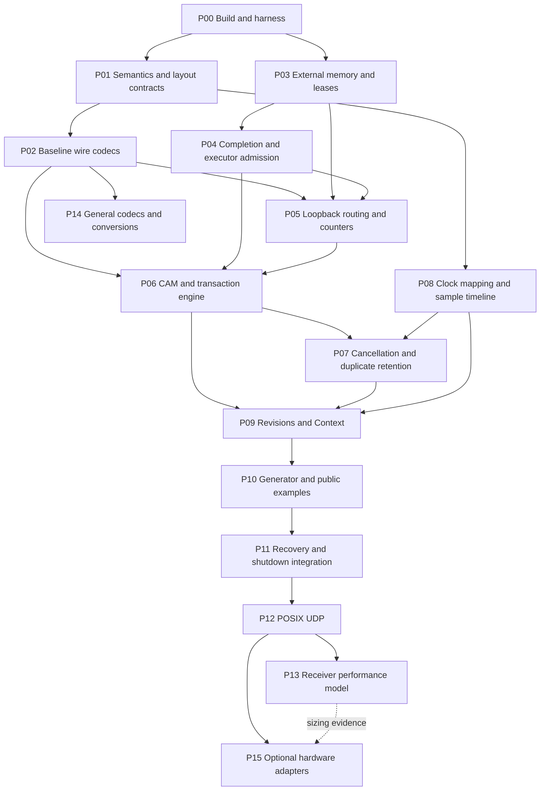

# VITA 49.2 implementation plan with implementer and verifier agents

Prepared 2026-09-18. Current execution status: M0–M3 complete; M4 functional software gates passed and P13 receiver characterization remains non-blocking. Execution throughM6 is authorized. P14 available-input continuation passes198/198 Release and195/195 ASan/UBSan checks with69 headers: nonrecursive fields, attributes, samples/extensions and explicit structural-only I9 are integrated. User-approved D-M5-1 now excludes Array production support from M5; P14 is complete for that declared scope and the M5 local software gate passes independent review ([acceptance](implementation/M5-operational-verification.md)). P15/M6 remains blocked on selected hardware/device/SDK inputs. D-P07-1 and D-P14-1/2/3/general raw-code policy remain accepted. See [package status and evidence](implementation/status.md); starting-point descriptions below record the pre-implementation baseline.

Authority: [framework architecture](vita49_framework_architecture.md), [protocol design](vita49_protocol_design.md), and [accepted profile](iq_generator_profile_proposal.md). Preserve architecture Decisions 1–10 and the September 18 clock, completion, recovery, budget, and ODR clarifications. This plan allocates implementation and verification work; it does not reopen those decisions or convert proposed performance into demonstrated capability.

## 1. Outcome and starting point

Deliver a C++23 header-only semantic/codec/runtime core, deterministic loopback and virtual backend, the IQ Generator v1 application, and an optional compiled POSIX UDP adapter. Complete the documented operational profile and advertised bounded field/sample coverage in M5, excluding Array-of-CIFs under D-M5-1; qualify optional hardware/device-memory adapters separately in M6.

The repository currently contains specifications, JSON architecture fixtures, and a Python consistency checker. It has no C++ implementation or CMake project. The existing 190 checks validate constants, table arithmetic, and scenario structure. In particular, S1–S16 are descriptions, not executed transaction/clock/recovery tests. Keep that checker as a specification smoke check; do not count it as implementation conformance evidence.

Completion means runnable Controller, Controllee, and combined examples; verified wire/ownership/runtime behavior; complete advertised coverage; reproducible resource and benchmark reports; and explicit deployment qualification status. An M4 baseline release may advertise bounded IQ-profile functionality before M5, but cannot claim complete standard-field support.

## 2. Agent roles and operating rules

| Role | Assignment | Authority and restrictions |
|---|---|---|
| Coordinator | Own dependencies, interface decisions, integration, evidence index, and release status | Splits work, resolves conflicts, assigns exclusive file ownership; cannot replace missing evidence with an assertion |
| Implementer `I-<package>` | Implement one bounded work package and its developer tests | Changes assigned production paths and unit tests; supplies API/lifetime notes, commands, results, and known limits |
| Verifier `V-<package>` | Independently test and review the same package | Owns verifier tests/reports; evaluates actual production APIs against requirements, not the implementer's explanation alone |
| Specialist slot | Independent codec, timing, or platform package when dependencies permit | Concrete bounded work only; may not concurrently edit shared interfaces |

Use at most four active agents: coordinator, one implementer, one verifier, and one optional independent worker. These are reusable roles, not a requirement to keep dozens of agents alive. A verifier can prepare an independent oracle while implementation runs, then test the exact candidate revision. Verification never gates on incomplete files being edited concurrently.

Use isolated worktrees after a clean implementation baseline is established, or explicit disjoint ownership in the shared workspace. Preserve existing user edits; do not reset or silently commit them. The coordinator alone integrates top-level build/CI changes and shared public contracts. Other agents propose changes to those contracts before dependent edits. A verifier does not repair production code and then approve its own repair: report a reproducible failure to the implementer, retest the correction, and retain the independent failing regression.

Package state: `ready -> implementing -> candidate -> verifying -> passed -> integrated`. A verification failure returns to `implementing`. `blocked` records a concrete unavailable input, not merely a failing test. Implementation success and verifier approval both name the source revision or patch hash. Any later relevant edit invalidates that approval; rerun affected tests on the integrated revision. Full milestones require integration evidence beyond individual package passes.

## 3. Proposed repository layout and ownership

Paths below are to be created during implementation; they do not yet exist.

```text
include/vita/
  fields/                 # identities, units, descriptors, semantic values
  codec/                  # layouts, traversal, packet/sample codecs
  memory/                 # views, providers, leases, envelopes
  runtime/
    completion/           # ticket publication and lifetime
    execution/            # executors, strands, bounded queues, admission
    transaction/          # CAM, correlation, cancellation, outcomes
    timing/               # monotonic/protocol clocks, sample timeline
    context/              # revisions, publisher, receiver cache
    stream/               # routing, lifecycle, recovery
  profile/iq_generator_v1/
  adapters/loopback/
adapters/posix_udp/
examples/{controller,controllee,combined}/
tests/{unit,verification,integration,compile}/
tests/support/             # virtual clocks, deterministic executor, fake devices
fuzz/
bench/
cmake/
docs/implementation/       # evidence index, coverage and qualification reports
```

The coordinator assigns ownership of specific headers before work starts. Separate implementation and verification test directories to avoid accidental oracle coupling. Shared test helpers provide clocks and byte buffers, not production-derived expected answers. M0 chooses/pins a test harness as a test-only dependency; the core remains standard-library-only. Use plain CTest executables if a dependency provides no clear benefit. No optional reflection path or hardware adapter is required for the baseline.

## 4. Dependency and scheduling plan

Preserve M0–M6 as architectural release gates. Bring memory, completion, and admission foundations forward before M2 because transactions cannot be correct without them.



The dashed P13 link supplies performance-sizing evidence; it is not a hard software prerequisite.

Useful parallel work: P01 with P03 after P00; P08 after its clock/value interfaces freeze while P06/P07 progress; P14 after stable traversal while M3/M4 progress. Do not parallelize P06/P07 edits to the same transaction headers or P09/P11 edits to lifecycle contracts. P13 may prepare measurement tooling early, but cannot qualify an unfinished runtime. P14 is required for M5 even though the diagram does not put it on the initial IQ baseline's critical path.

## 5. Implementer/verifier work packages

Every row is a task card. `Deps` means passed prerequisites, except expressly frozen interfaces used for independent test preparation. Verifier ownership covers `tests/verification/<package>/` and `docs/implementation/<package>-verification.md`. Production paths follow §3. Each package has exactly one implementer and an independently assigned verifier.

### M0: build, semantic types, and baseline traversal

| Package / agents | Deps / production ownership | Implementer deliverable | Verifier acceptance evidence |
|---|---|---|---|
| P00 / I-P00, V-P00 | None; coordinator integrates CMake, presets, CI, compile tests | INTERFACE core target; optional adapter targets; C++23 language/library probes; test harness; Debug, ASan/UBSan, TSan builds; documentation checker target | Compile multiple TUs; link a core-only executable without adapter dependencies; verify no RTTI/exception requirement; different policy template instantiations coexist; unsupported library fails clearly |
| P01 / I-P01, V-P01 | P00; `fields/`, codec layout interfaces | Strong units, typed selectors/attributes, semantic packet composition; shared measure/encode/decode traversal contract; bounded arena and structured errors; atomic builder edits and immutable snapshots | Missing attribute update leaves prior object unchanged; selector-only layout has no values; measure invalidation follows layout edits; no semantic packet owns encoded buffers; overflow/unknown-extent tests through public APIs |
| P02 / I-P02, V-P02 | P01; baseline `codec/` | All family prologues and header options; baseline fields; query/cancel/diagnostic/state body distinctions; IQ16/IQ32/float32 scalar packing; short-output reporting; cursor/index checks | Independent wire vectors including W1–W8; malformed/truncated inputs stop before callbacks; reserved codes reject; diagnostic bodies use 32-bit diagnostics and original request context; no allocation after setup; two-TU codec linkage |

M0 gate uses the completed baseline portion of P02, not every M5 field. P02's envelope and sample completion also contributes to M1. Encode/decode round trips are supplemental: V-P02 derives selected expected bytes directly from cited standard layouts and manually reviewed constants, never from the encoder under test.

### M1: ownership, progress, and end-to-end loopback

| Package / agents | Deps / production ownership | Implementer deliverable | Verifier acceptance evidence |
|---|---|---|---|
| P03 / I-P03, V-P03 | P00; `memory/` | Configurable size classes, move-only leases, callback borrows, explicit retention quotas, RX envelopes, three-region TX chains, bounded physical RX fragments, acquisition rollback | Instrumented providers prove one return per block; independent IQ retention preserves shared allocation; partial acquisition rollback returns every acquired block; conversion does not mutate RX; retained handles outlive runtime; rejection versus accepted-send ownership distinct |
| P04 / I-P04, V-P04 | P03; `runtime/completion`, `runtime/execution` | Tagged completion slots with prescribed memory orders; lifetime handles; deterministic/caller-driven executors; control strands; bounded queue/arena admission bundles; cancellation and completion reserves | Execute S12/S13/S16 through real ticket code; producer/consumer races; delayed publication; stale generations; wrap retirement; saturated queues still drain tickets; synthetic failure never releases device storage; deterministic interleavings plus TSan, not TSan alone |
| P05 / I-P05, V-P05 | P02–P04; `adapters/loopback`, initial routing | Deterministic transport with sync reject, deferred completion, loss, reordering, duplication, and failure injection; route keys, peer/class registration, Packet Count ownership | Segmented and contiguous sends yield identical logical bytes; 16-fragment limit enforced; paired SID roles route correctly; SID-less ambiguity rejects; one counter per sender/SID/type; synchronous rejection does not consume count; local traffic uses normal codec/admission |

P04 creates the actual-size budget ledger and compile-time size ceilings for available types; each subsequent package updates its category reservations. V-P04 verifies admission against real arena bytes. P13 reconciles the finished implementation rather than discovering feasibility for the first time.

M1 closes only after P02–P05 integration demonstrates encode -> leased transport -> checked decode -> retained payload -> final reclamation without protocol threads in application code. Physical device memory is modeled with a non-CPU-addressable fake; real GPU/DMA proof is M6.

### M2: commands and transaction correctness

| Package / agents | Deps / production ownership | Implementer deliverable | Verifier acceptance evidence |
|---|---|---|---|
| P06 / I-P06, V-P06 | P02, P04, P05; transactions/CAM, virtual backend | Whole-command side-effect-free validation, dependency plan, P/W/Er, typed outcomes, asynchronous execution, V/X/S sequencing, dry-run isolated state, no-Ack/NACK-only observations, pre-effect reservation | Execute all action/PWE/request/detail/NACK factors against production code; explicit profile-invalid combinations; S1/S2; unrecoverable errors never execute; P=0 prevents known partial admission but reports actual unexpected write failure; no false success from send, simulation, silence, or timeout |
| P07 / I-P07, V-P07 | P06, P08; cancellation/correlation/retention | Per-field cutoff/disarm; original/cancel response distinction; key and generation scoping; canonical duplicate comparison/replay; retention byte/count credits; Message ID wrap and restart handling | S3/S4/S10; cancellation races at each phase; late completion cannot resurrect cancelled work; same-key/different-body conflict; replay preserves old state observation; no live cache eviction; cancellation progresses when ordinary queue full; local timeout does not send cancellation |

V-P06 records interpretation IDs I1, I5–I8, I10–I12 on affected cases. Tests prove the selected project dialect; they do not resolve the standard's ambiguity. Add ordinary and cancellation AckP/SchX tests separately because their meanings differ. Quiescence and completion remain separate even if the device reports a terminal failure.

P08 clock foundations are pulled forward for P07 scheduled-cancellation verification; their full qualification remains part of M3. Before P06 starts, freeze a bounded planned/effective-state interface jointly with the P09 owner. P06 tests use the isolated virtual backend through that interface; P09 integrates revisions without creating a second command execution path.

### M3: clocks, revisions, generation, recovery

| Package / agents | Deps / production ownership | Implementer deliverable | Verifier acceptance evidence |
|---|---|---|---|
| P08 / I-P08, V-P08 | P01, P04; `runtime/timing` | Separate monotonic/protocol/sample clocks; exact rational timestamp accumulation; qualified clock states, PPS/time-of-day mapping; mode windows, boundary selection, uncertainty and mapping generations | T1–T6 plus endpoints and carry/overflow tests; S5/S11; protocol jumps do not change monotonic deadlines; mode0 does not enable unqualified Data; loss/holdover expiration; rates1 and100M; timed request with no eligible boundary rejects |
| P09 / I-P09, V-P09 | P06–P08; `runtime/context` | Requested/pending/effective revisions; bounded revision credits; per-field validity; full Context-before-affected-Data gate; effective-time history and RX waiting; nonpersistent events | S6–S9; old encoded packet immutable; separate effective times yield separate Context; AckX proceeds despite publication failure; no stale required value after indeterminate write; late Context never rewrites delivered history; history exhaustion and lost-refresh behavior explicit |
| P10 / I-P10, V-P10 | P05, P09; IQ profile, public bindings, examples | Deterministic source, complete-pair packetization, MTU adaptation, wall-clock pacing/catch-up, uncommon boundary rate updates; Controller/Controllee/combined examples; optional provider replacement | Canonical IQ bytes/scaling/rounding; low-rate packetization cap; phase/timeline continuity; no unbounded catch-up burst; default/trailer variants distinct; examples contain no protocol loops, manual Acks, or buffer-return machinery; same-domain blocking wait rejects |
| P11 / I-P11, V-P11 | P07, P10; stream lifecycle/recovery integration | `recover_stream`, fresh paired SID and peer-ready prerequisite; old-generation tombstones/outcomes; stop/drain/quarantine, unknown-state restart guard; complete lifecycle error APIs | S14/S15 plus stalled/failed recovery; same-SID request rejected; late old callbacks cannot mutate new stream; known snapshot required before new Data; app-retained leases survive recovery; 2s graceful limit never causes unsafe reclamation |

P08 clock capabilities can be injected for deterministic tests without GPS hardware. P11 tests peer readiness through an explicit application test double, not an invented wire reset message. Normal start/resume must not bypass unknown-state recovery.

### M4: external transport and receiver performance characterization

| Package / agents | Deps / production ownership | Implementer deliverable | Verifier acceptance evidence |
|---|---|---|---|
| P12 / I-P12, V-P12 | P11; compiled `adapters/posix_udp` | IPv4/IPv6 sockets, asynchronous ownership contract, gathered TX, contiguous RX, MTU/no-fragment policy, fair control/data service, bounded error handling | Real socket integration and independent packet decode; one packet/datagram; transport completion is not delivery; whole-send rejection/failure cases; flood does not consume completion/control reserves; smaller MTU cannot truncate; shutdown and deferred callbacks |
| P13 / I-P13, V-P13 | P12; `bench/`, budget reporting, performance-model docs | Receiver-only harness with a separate production sender; stage counters/traces; packet/byte/sample-rate, CPU, memory and latency models; reproducible load sweeps and uncertainty | Independently reconcile offered traffic, receive/delivery/consumption and observed drops; validate byte/ownership/Context paths and budget/allocation contracts; repeat representative loads and validate model predictions; report limits and unknown loss attribution. Historical 30-minute/no-drop and 1 ms/2 ms Control points are characterization references, not hard software gates |

M4 tracks software integration, receiver characterization/model coverage, and deployment qualification separately. Production IQ generation is on another machine; local generator skips do not block software integration or prove receiver loss. P13 remains ongoing characterization rather than a prerequisite zero-drop benchmark on the development host. Hardware is selected to satisfy application requirements using the resulting receiver model. See [accepted direction and receiver experiment plan](implementation/P13-receiver-performance-model.md). Missing authorized OUI, clock binding, peer, or hardware blocks the applicable external qualification, not deterministic implementation work. Use optional-field-omitting generic codec vectors in isolated tests or explicitly supplied lab configuration; never invent a production OUI. Loopback/localhost traffic alone cannot pass independent-peer interoperability. 100MS/s is a separate reported stress qualification, not a substitute for the normal benchmark.

### M5 and M6: operational scope, bounded codecs and optional devices

| Package / agents | Deps / production ownership | Implementer deliverable | Verifier acceptance evidence |
|---|---|---|---|
| P14 / I-P14, V-P14 | P02 frozen traversal and P03 storage API; remaining descriptors/codecs | Documented IQ profile plus96 supported nonrecursive fields,13 CIF7 shapes, bounded structures/lists and sample codecs, registered extensions; Array-of-CIFs excluded under D-M5-1 | One coverage row per field/layout/attribute/format with clause and test IDs; independent golden boundaries; nested length/work-limit fuzzing; packing tags/repetition/padding tests; Array exclusion verified; optional I9 utility labeled separately; unknown layout never skipped by guessing |
| P15 / I-P15, V-P15 | M4 software gate plus adapter-specific dependencies; separate adapter paths | Only selected, explicitly scoped DMA/GPU/DPDK/RDMA or hardware backend; timing/quiescence/fence and disarm contracts | Device-specific evidence for visibility and reclamation, actual timing/uncertainty, hardware failure and cancellation cutoff; hardware signal tests separate from register completion; absent hardware means qualification blocked |

Split P14 into individually verified batches: remaining CIF0; CIF1 scalar/structured; CIF2 identifiers/lists; CIF3 temporal/environmental; CIF7 and array traversal; general sample conversions. Assign exclusive descriptor ranges and separate verifier vectors. Shared traversal changes go back through V-P02/P09 regression gates. M5 requires all advertised bounded coverage to pass; unsupported or interpretation-dependent entries remain visible. D-M5-1 excludes Array production/native/peer integration from the gate; I9 evidence is required only for future Array interoperability claims. Retain its optional structural utility and tests without enabling production use. See [operational acceptance scope](implementation/M5-operational-scope.md). M6 is optional and must not delay the baseline by pulling every listed adapter into scope.

## 6. Verification oracle and evidence policy

Each verifier starts from the relevant architecture clauses, protocol tables and normative source, writes expected observations, then exercises the implementation. The normative PDF is `/Users/rklinkhammer/Downloads/AV49DOT2-2017-R2024.pdf`; printed page references differ from PDF page numbers by16. Do not commit the licensed PDF. If it is unavailable, mark clause-level verification blocked; document tests can continue without claiming that review occurred.

Maintain these distinct evidence classes:

| Evidence | What it establishes | What it does not establish |
|---|---|---|
| Existing Python checker | Specification arithmetic and fixture consistency | C++ codec/state-machine correctness |
| Independent golden vectors | Selected exact wire layouts and expected errors | Full field coverage or independent peer interoperability |
| Executable S1–S16 scenarios | Observable production state transitions under supplied events | All real-thread interleavings |
| Deterministic concurrency + memory-order review | Adversarial transition ordering and ownership invariants | Exhaustive hardware memory-model proof |
| ASan/UBSan/TSan runs | Detected memory/UB/race failures within exercised executions | Absence of every race, deadlock, or DMA lifetime error |
| Instrumented providers/allocator/budget report | Actual tested allocation and reclaim counts, type-size budget | Real device quiescence without adapter evidence |
| Peer captures and hardware benchmarks | Qualified configuration's measured behavior | Universal VITA compatibility or all-platform timing guarantees |

V-P06 generates the legal/invalid Cartesian CAM input space from independently encoded appendix predicates, using production engine results as actuals. Do not reuse production CAM decision helpers in the expected oracle. V-P02 reviews golden bytes directly; production encoder output cannot create its own golden corpus. Keep round trips as an additional invariant, not the only oracle.

For interpretation-dependent tests, record `interpretation_id`, selected behavior, peer agreement status and fixture IDs. No agent “fixes” an interoperability failure by silently changing I1–I12 or weakening an assertion. Escalate a documented architecture change through the coordinator and rerun affected suites.

## 7. Handoff templates

Implementer task prompt:

> Implement package Pxx only, using the assigned architecture sections and frozen public contracts. Edit only the listed production/test paths. Preserve external ownership, bounded admission, and selected protocol interpretations. Include developer tests and compile-tested public usage. Do not mark qualification or unsupported coverage complete without evidence. Return changed paths, interface changes, assumptions, exact build/test commands and results, allocation/lifetime impacts, remaining failures, and candidate revision/hash. Stop to report an architecture contradiction rather than choosing a new wire interpretation silently.

Verifier task prompt:

> Independently verify candidate Pxx at the named revision/hash against the cited requirements. Own verification tests and report files, not production repairs. Derive expected bytes/state from specification/profile contracts rather than production helpers. Run the package gate and affected integration regressions. Report each failure with input, expected/actual behavior, source requirement, reproduction command, and severity. Distinguish tested, inspected, untested, and blocked items. Approve only the tested scope; missing platform/peer evidence remains blocked, not passed.

Required handoff record:

```text
Package / candidate revision:
Requirements and interpretation IDs:
Owned paths and interface changes:
Verification environment and toolchain:
Commands and raw result locations:
Independent oracle / fixture provenance:
Allocation, ownership, concurrency evidence:
Failures and untested/blocked claims:
Verdict: PASS | FAIL | BLOCKED
Integration revision and regression result:
```

Reports go in `docs/implementation/`; large logs/captures go in the CI artifact store or a local ignored artifacts directory, with stable identifiers in the report. Never store sensitive captured payloads merely to satisfy evidence collection.

## 8. Build and gate execution

P00 must create presets/CTest labels matching the following proposed interface before subsequent packages depend on them. These commands are a planned interface, not commands available in the current repository.

```sh
cmake --preset dev
cmake --build --preset dev
ctest --preset dev --output-on-failure
cmake --preset asan-ubsan
cmake --build --preset asan-ubsan
ctest --preset asan-ubsan --output-on-failure
cmake --preset tsan
cmake --build --preset tsan
ctest --preset tsan -L concurrency --output-on-failure
```

Gate labels: `compile`, `codec`, `ownership`, `concurrency`, `transaction`, `timing`, `context`, `recovery`, `udp`, `budget`, and `integration`. Keep long benchmarks and peer/hardware qualification opt-in, with explicit configuration and reports; do not silently skip a mandatory qualified-release gate. GCC/libstdc++ and Clang/libc++ Linux jobs implement the architecture's toolchain targets; macOS is functional development coverage. Sanitizer builds are separate from performance measurements.

The existing command remains runnable now:

```sh
python3 docs/fixtures/check_architecture_fixtures.py
```

Do not repeat all expensive qualification after documentation-only changes. After production fixes, rerun failing/affected suites and the integrated milestone smoke suite; broaden only for changed shared contracts or unexplained failures. Changing ownership, cursor traversal, CAM interpretation or timing mappings requires regressions in every consuming package.

## 9. Deployment blockers and release gates

| Architecture input | Work that can proceed | Evidence blocked until supplied |
|---|---|---|
| D1 OUI / identities | Generic fixtures, deterministic runtime, registration validation | External profile Class ID emission/interoperability |
| D2 clock source / epoch | Injected clocks, PPS-loss/step simulation, monotonic benchmarks | GPS-conditioned production start |
| D3 timing / cutoff qualification | Virtual timing windows and failure paths | Real timed execution guarantees |
| D4 target hardware / envelope | Budget sizing implementation and harness | Measured production performance |
| D5 peer / I1–I12 agreement | Explicit project-dialect tests | Interoperability claims for affected layouts |
| D6 trust boundary | Isolated-network functional tests and authorization hooks | Untrusted deployment approval |
| D7 packet lifetime / restart coordination | Fresh-identity restart, stale-generation tests | Safe reused-wire-identity qualification |

Coordinator maintains separate `implemented`, `verified locally`, and `qualified for deployment` columns per feature. A remaining deployment input is never filled with an invented value to turn a gate green.

Final software acceptance: M0–M3 integrated; M4 software tests and executable examples; M5 published supported operational/bounded codec coverage with D-M5-1 exclusions; no unverified ownership/admission/completion path; actual memory budget fits; required controls/observations distinguish unknown outcomes; documentation agrees with public APIs. Deployment release additionally requires the applicable M4 measurements and peer/clock inputs. Optional hardware claims require M6 evidence.

## 10. First execution batch

1. Coordinator records the current specification baseline and prepares P00 without overwriting existing user changes.
2. I-P00 creates the build/test skeleton; V-P00 independently prepares two-TU, feature-probe, and adapter-isolation checks.
3. After P00 passes, run I-P01 and I-P03 on disjoint paths, with the remaining worker slot used for the current highest-risk verifier assignment. Coordinator freezes common error/view/value interfaces before integration.
4. Advance P02 and P04; prove packet parsing and completion/lease correctness before admitting effectful commands.
5. Continue along the dependency graph with candidate-specific verifier reports. Do not implement the entire library in a single agent task.

This delivery contains the implementation plan. The first execution batch above is the starting point for subsequent implementation work.

## Post-M5 P16: Controller frequency-scan example

Authorized2026-09-19 under [the execution prompt](frequency_scan_example_implementation_prompt.md). This is additive operational capability, not a revision of the completed M5/D-M5-1 baseline. P15/M6 remains reserved for selected hardware.

P16 stages: independently freeze profile/state/API contract; implement and verify bounded runtime/Context/backend extension; add virtual RF scene and Controller scan policy; gate combined loopback; gate separate-process POSIX UDP when enabled; complete teaching documentation, memory ledger and affected regression/sanitizer reports. Preserve original IQ v1 permissions. Completed locally on 2026-09-19: 229/229 Release, 225/225 ASan/UBSan, 71 standalone headers, six targeted TSan checks and two UDP-disabled combined example checks pass. [P16 status](implementation/P16-status.md) and its independent report preserve scope, source identities and evidence. Hardware/deployment qualification is separate.
