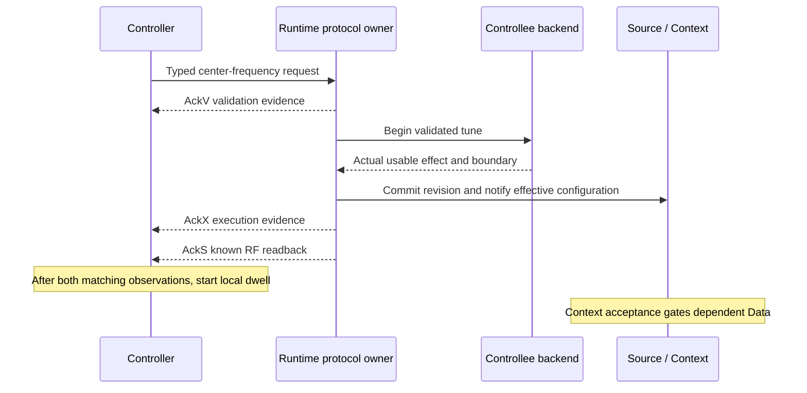

# Frequency scan teaching example

The example targets are implemented and independently verified in P16’s local Release and sanitizer gates. See the [final integration report](../../docs/implementation/P16-integration.md). The [P16 contract](../../docs/implementation/P16-contract.md) defines the profile; the [helper report](../../docs/implementation/P16-example-implementation.md) records current implementation evidence.

The example separates a Controller that requests a center frequency from a Controllee that owns the source and device backend. A combined configuration places both roles in one Runtime. A separate-process configuration uses the optional compiled POSIX UDP adapter and a remote-only Controller endpoint: representing a remote device must not create a local device or execute its commands locally.

## What a scan point means

The default scan visits 100.000 through 100.200 MHz in 25 kHz steps. It uses 100 ksample/s, a 100 ms dwell and a 1000 ms command timeout. One finite sweep is the default; a positive sweep count or explicit continuous mode controls repetition. The public CLI requires positive integer dwell and timeout values. Sample rate is fixed for the configured tunable source session and is never changed by a sweep command.

Each point has one transaction identity. The Controller submits a typed center-frequency command, retains its handle, and observes distinct protocol phases:

| Evidence | What it establishes |
|---|---|
| Local submission/transport acceptance | Local ownership or transport progress; no remote execution proof |
| AckV | Validation outcome; acceptance does not prove execution |
| AckX | Reported execution outcome; the scan requires success, nonsimulated execution and no partial/unknown result |
| AckS | A state observation; the scan requires known RF center equal to the requested frequency |

Only matching AckX **and** AckS for the current transaction start dwell. They may arrive in either order. Dwell begins when the later required observation is received, using the Controller's local monotonic clock. A repeated observation does not restart dwell. An old transaction's retained reply cannot confirm a new point.



The diagram illustrates one arrival order; AckX and AckS may be reordered. Execution confirmation establishes usable tuning according to the backend contract, not receipt of IQ packets. Context/Data transport failures or a later source fault can interrupt delivery after a truthful successful tune.

Timeout stops further submissions and reports uncertainty. It does not prove that the device remained unchanged and does not automatically send cancellation. Transaction release relinquishes the application handle; it does not erase retained duplicate/correlation evidence or authorize MID reuse before the framework's retention rules permit it. Observer callbacks record bounded state and return; formatting, terminal output and other potentially blocking work run outside callbacks.

## Reading the virtual signal

The scene has a single absolute RF tone at 100.050 MHz with amplitude 0.5. Baseband offset is `tone RF − center RF`. The passband is `[-Fs/2, Fs/2)`: the lower Nyquist edge is included and the upper edge is excluded. Out-of-band output is zero rather than an aliased tone.

| Center | Offset at 100 ksample/s | Expected output |
|---|---:|---|
| 100.000 MHz | +50 kHz | Zero: excluded upper edge |
| 100.025 MHz | +25 kHz | Positive-frequency IQ tone |
| 100.050 MHz | 0 | DC at the accumulated phase |
| 100.075 MHz | −25 kHz | Negative-frequency IQ tone |
| 100.100 MHz | −50 kHz | Included lower edge |
| 100.125–100.200 MHz | Below −50 kHz | Zero |

A retune changes future LO phase slope, not accumulated phase. Tone and LO phases continue through skipped samples and out-of-band intervals. Every real effective configuration event advances the missing interval using the old center before installing the new center. Merely reading the newest snapshot after several retunes would lose that history. A fresh source session starts a fresh phase epoch; ordinary tuning does not.

## Clocks, identities and UDP

The Controllee and combined teaching configurations use explicitly injected lab time and simulated PPS observations, not a GPS receiver or calibrated hardware. The remote-only Controller does not inject PPS; its untimed commands and deadlines use local monotonic time. Source progress, Controller deadlines and dwell are driven by actual local monotonic elapsed time in separate processes, including idle periods. Protocol timestamps have their own explicitly configured epoch. Never subtract monotonic values from different processes to claim network latency.

Fixture peer identities, class assignments and any fixture OUI are isolated-lab settings. They are not production allocations or evidence of independent-vendor interoperability. UDP needs an agreed profile, identities and three explicit lane addresses: Data, ordinary control/Context, and cancellation. Source-address matching is a routing constraint, not authentication. The proposed loopback port map and lifecycle requirements are in [UDP readiness](../../docs/implementation/P16-udp-readiness.md); the runnable developer-tested commands are below.

See [PORTING.md](PORTING.md) for the real device boundary and ownership contract.

### Loopback endpoint option helper

The pure `endpoint_options.hpp` parser accepts `--local-base-port` and `--peer-base-port`. Controller defaults are 41000/42000; Controllee defaults reverse them. Each base reserves three consecutive ports for Data, Control/Context and cancellation. Zero, bases above 65533, overlapping local/peer ranges and duplicate base options reject. All numbers are unsigned decimal. Existing scan flags retain their rules; unknown flags reject.

This parser deliberately supports only `127.0.0.1`, with isolated fixture identities and simulated PPS. It has no external-address switch. External operation needs a separate explicit deployment configuration, not forwarding lab identities onto another network. `--sample-rate-hz` describes the configured source session or the Controller's expected remote format; it does not send a remote SampleRate write or negotiate a rate. Matching process configuration remains required. The executables use these parser contracts.


## Build and run

From the repository root, the UDP Release preset builds the optional compiled adapter and all three targets:

```sh
cmake --preset udp-release
cmake --build build/udp-release --target vita_frequency_scan_combined vita_frequency_scan_controller vita_frequency_scan_controllee
```

Combined deterministic time is useful for repeatable protocol demonstrations:

```sh
build/udp-release/examples/frequency_scan/vita_frequency_scan_combined --deterministic
```

Omit `--deterministic` for wall-clock pacing. For example, run two finite sweeps:

```sh
build/udp-release/examples/frequency_scan/vita_frequency_scan_combined --sweeps 2 --dwell-ms 100
```

For separate processes, start the Controllee first, then run the Controller in another terminal. These defaults are loopback-only; both processes must agree on sample rate and lane mapping:

```sh
build/udp-release/examples/frequency_scan/vita_frequency_scan_controllee --duration-ms 10000
build/udp-release/examples/frequency_scan/vita_frequency_scan_controller --sweeps 1
```

The Controllee prints a flushed `ready role=controllee` line after setup. The Controller exits after the finite scan; promptly stop the Controllee with Ctrl-C, or let its duration expire. It can continue to send Data while the peer has exited, and any substantive transport or drain error is reported. UDP may lose startup Context/Data before the Controller binds; the summary reports actual received/known packets and receiver drops without a lossless-delivery claim.

A bounded process driver selects currently free lane ranges, starts both roles, checks nine confirmed tunes against nine Controllee writes, and stops both children:

```sh
python3 examples/frequency_scan/run_pair.py --controller build/udp-release/examples/frequency_scan/vita_frequency_scan_controller --controllee build/udp-release/examples/frequency_scan/vita_frequency_scan_controllee
ctest --test-dir build/udp-release -R '^p16_example_' --output-on-failure
```

The combined target also builds without UDP enabled. Controller/Controllee process targets require `VITA_BUILD_POSIX_UDP=ON`. `--duration-ms` is an optional positive wall-clock bound (injected-time bound in deterministic mode); a Controllee without this flag runs until interrupted. `--continuous` and explicit `--sweeps` are mutually exclusive. No blocking stdin reader prevents idle progress.

Logs distinguish validation from execution. A tune line includes requested/applied Hz, the public handle identity `runtime/stream/slot/generation` (not a fabricated wire MID), command-to-confirmation latency, configured dwell, and sweep/point. A dwell completion line reports actual elapsed local time. These are demonstration logs, not benchmark latency qualification. Callbacks only update bounded state; output is written after Runtime progress returns.

Ctrl-C or duration termination explicitly requests best-effort RF cancellation **only if a tune remains in flight**, using `cancel(handle, QuerySelection{QueryField::center_frequency}, options)`, and pumps a bounded cancellation observation window before local shutdown. A command timeout follows a different path: it stops scanning without automatically cancelling or claiming no effect. Local shutdown does not prove remote physical quiescence.

The examples use one logical stream,16 transaction slots and a shared4096-entry/8MiB retention store. They retain the framework's bounded Controller identity history; sufficiently rapid or long scans can encounter admission limits, which stop the scan honestly. They do not evict retained identities to maintain apparent throughput. The source and scan objects live in application stack storage; setup-owned backend storage is declared and charged through DeviceBackendBinding. Printed `framework_bytes` is the Runtime startup ledger, excluding the process main stack and application/stdio overhead; it is not a whole-process RSS or64MiB proof.
